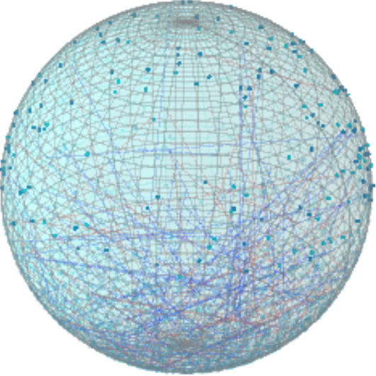
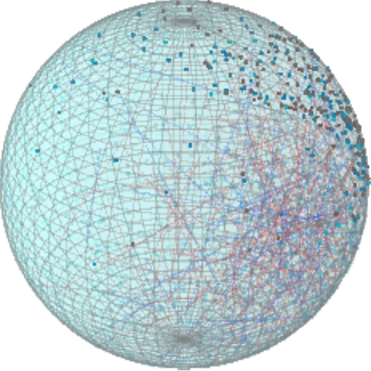
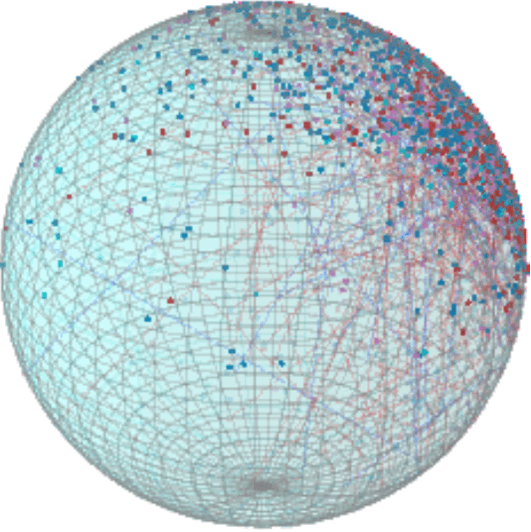

# Angular Constraint Embedding via SpherePair Loss for Constrained Clustering

This repository provides the official implementation of the paper _"Angular Constraint Embedding via SpherePair Loss for Constrained Clustering"_, including **SpherePair** and several baseline methods for Deep Constrained Clustering (DCC).

Using a geometrically formulated loss, SpherePair faithfully encodes pairwise constraints and leads to embeddings that are clustering-friendly in angular space, effectively separating representation learning from clustering. 
SpherePair outperforms state-of-the-art DCC baselines on various benchmark datasets, even when a simple K-means algorithm is applied to its learned representations.

In the examples below, which involve subsets of the Reuters dataset, we set the embedding dimension to $D=3$ and use the negative-zone factor $\omega = \pi / \arccos\bigl(-\frac{1}{K-1}\bigr)$ to ensure equidistant separation on a unit sphere. Each animation shows the training evolution for subsets of the Reuters dataset with different numbers of clusters $(K=2, 3, 4)$.

<p align="center">
  &nbsp;&nbsp;&nbsp;&nbsp;&nbsp;&nbsp;
  &nbsp;&nbsp;&nbsp;&nbsp;&nbsp;&nbsp;
  
</p>

---

## Requirements and Basic Usage

We provide an `environment.yml` file to set up the environment.  
You can run **SpherePair** and various **baseline models** (VanillaDCC, VolMaxDCC, CIDEC, SDEC, AutoEmbedder) on multiple datasets, using either **balanced** or **imbalanced** constraints, optionally with **pretraining**. 

1. **Data Preparation**  
   After downloading all project files, navigate to the `experiment` directory and merge the pre-sliced data (which are already preprocessed/vectorized according to our paper) by running:
   ```bash
   python dataset_merge_split.py merge
   ```
   This command reconstructs the complete dataset files for your experiments.

2. **Experiment Flow**  
   A typical flow for running SpherePair or baselines is as follows:
   1. *(Optional)* **Pretrain** an autoencoder if needed by the model (e.g., SpherePair with `--use_pretrain "True"`).
   2. **Generate** a constraint set via `tool_createCons.py` (balanced or imbalanced).
   3. **Run** the corresponding model script (e.g., `run_model_Sphere_Kmeans.py`) to train and evaluate clustering performance.

You can adapt the scripts to different datasets (`mnist`, `fmnist`, `reuters`, `cifar10`, `stl10`, `imagenet10`, `cifar100`), different constraint sizes/rules, or different model versions.

> **Note**: Logs and intermediate outputs are typically stored under `experiment/exp_{expName}/lab_{modelVersion}/{dataset}/{consRule}/`.

---

## SpherePair Demo on FashionMNIST

Below are four quick demos showing **SpherePair** on `fmnist` with balanced/imbalanced constraints and pretrain/no-pretrain. Adjust the arguments and file names as needed for your own setup.

<details>
<summary><b>1) Balanced + Pretrain</b></summary>

```bash
# Pretrain the SpherePair autoencoder
python tool_pretrain_sphere.py --dataset "fmnist"  # default --dim=10

# Generate 10 incremental balanced constraint sets for training (1k~10k)
python tool_createCons.py --dataset "fmnist" --consRule "balance" --set "train" \
    --orig_num "1000" --extra_num "9000" --J "10" --imbCluster "0" \
    --modelVersion "Sphere_Kmeans_Pretrain" --expName "demo"

# Run SpherePair with KMeans (pretrained)
python run_model_Sphere_Kmeans.py --dataset "fmnist" --consRule "balance" --consIndex "10" \
    --use_pretrain "True" --epochs "300" --expName "demo"
```
</details>

<details>
<summary><b>2) Balanced + No Pretrain</b></summary>

```bash
# Generate balanced constraints (similarly, but modelVersion => "Sphere_Kmeans_noPretrain")
python tool_createCons.py --dataset "fmnist" --consRule "balance" --set "train" \
    --orig_num "1000" --extra_num "9000" --J "10" --imbCluster "0" \
    --modelVersion "Sphere_Kmeans_noPretrain" --expName "demo"

# Run SpherePair with KMeans (no pretrain)
python run_model_Sphere_Kmeans.py --dataset "fmnist" --consRule "balance" --consIndex "10" \
    --use_pretrain "False" --epochs "300" --expName "demo"
```
</details>

<details>
<summary><b>3) Imbalanced + Pretrain</b></summary>

```bash
# Pretrain SpherePair autoencoder
python tool_pretrain_sphere.py --dataset "fmnist"

# Generate imbalanced constraints for train (extraCLs)
python tool_createCons.py --dataset "fmnist" --consRule "extraCLs" --set "train" \
    --orig_num "10000" --extra_num "90000" --J "10" --imbCluster "0" \
    --modelVersion "Sphere_Kmeans_Pretrain" --expName "demo"

# Run (pretrained)
python run_model_Sphere_Kmeans.py --dataset "fmnist" --consRule "extraCLs" --consIndex "10" \
    --use_pretrain "True" --epochs "300" --expName "demo"
```
</details>

<details>
<summary><b>4) Imbalanced + No Pretrain</b></summary>

```bash
# Same approach but modelVersion="Sphere_Kmeans_noPretrain" and use_pretrain="False"
python tool_createCons.py --dataset "fmnist" --consRule "extraCLs" --set "train" \
    --orig_num "10000" --extra_num "90000" --J "10" --imbCluster "0" \
    --modelVersion "Sphere_Kmeans_noPretrain" --expName "demo"

python run_model_Sphere_Kmeans.py --dataset "fmnist" --consRule "extraCLs" --consIndex "10" \
    --use_pretrain "False" --epochs "300" --expName "demo"
```
</details>

---

## More Experiments

For broader experiments (using different datasets, constraint settings, model versions):

- **`--expName`** can be anything you like. Just ensure the same `--expName` is used in both `tool_createCons.py` and `run_model_{modelname}.py`, so the correct constraint files get loaded.
- Make sure the **`--consRule`** in the constraint generation step matches the **`--consRule`** in your run script for consistent file paths.
- **`modelVersion`** must match its corresponding script. For example:
  - `Sphere_Kmeans_Pretrain` -> `run_model_Sphere_Kmeans.py --use_pretrain "True"`
  - `Sphere_Kmeans_noPretrain` -> `run_model_Sphere_Kmeans.py --use_pretrain "False"`
  - `Sphere_Hierarchical_Pretrain` -> `run_model_Sphere_Hierarchical.py --use_pretrain "True"`
  - `Sphere_Hierarchical_noPretrain` -> `run_model_Sphere_Hierarchical.py --use_pretrain "False"`
  - `AutoEmbedder_Kmeans_Pretrain` -> `run_model_AutoEmbedder_Kmeans.py --use_pretrain "True"`
  - `AutoEmbedder_Kmeans_noPretrain` -> `run_model_AutoEmbedder_Kmeans.py --use_pretrain "False"`
  - `AutoEmbedder_Hierarchical_Pretrain` -> `run_model_AutoEmbedder_Hierarchical.py --use_pretrain "True"`
  - `AutoEmbedder_Hierarchical_noPretrain` -> `run_model_AutoEmbedder_Hierarchical.py --use_pretrain "False"`
  - `CIDEC_Pretrain` -> `run_model_CIDEC.py --use_pretrain "True"`
  - `CIDEC_noPretrain` -> `run_model_CIDEC.py --use_pretrain "False"`
  - `SDEC_Pretrain` -> `run_model_SDEC.py --use_pretrain "True"`
  - `SDEC_noPretrain` -> `run_model_SDEC.py --use_pretrain "False"`
  - `VanillaDCC` -> `run_model_VanillaDCC.py`
  - `VolMaxDCC` -> `run_model_VolMaxDCC.py`
- If a model requires **pretrained weights**, please run the corresponding pretraining first (and keep the same `--dim`):
  - For **SpherePair**, use `tool_pretrain_sphere.py`.
  - For **any other** autoencoder-based models, use `tool_pretrain_sdae.py`.
- Intermediate files, logs, and results will appear under `experiment/exp_{expName}/lab_{modelVersion}/{dataset}/{consRule}/`.
- When running `python run_model_Sphere_Kmeans.py`, you can specify `--omega` and `--dim` to try different parameter combinations. However, if you use pre-trained weights, ensure that the `--dim` specified during pretraining matches the one during training.

Below are examples of hyperparameter tuning that are required for the baseline methods **AutoEmbedder** and **VolMaxDCC**.

<details>
<summary><b>AutoEmbedder alpha search</b></summary>

```bash
# Example of alpha grid search: (1,10,50,100,500,1000,5000,10000)
alphas=(1 10 50 100 500 1000 5000 10000)
datasets=("mnist" "fmnist" "reuters" "cifar10" "stl10" "imagenet10" "cifar100")

# 1) Pretrain an SDAE for each dataset (with --finetune True)
for dataset in "${datasets[@]}"
do
    python tool_pretrain_sdae.py --dataset "$dataset" --finetune "True"
done

# 2) Generate constraints and test each alpha
for dataset in "${datasets[@]}"
do
    python tool_createCons.py --dataset "$dataset" --consRule "balance" --set "train" \
        --orig_num "1000" --extra_num "9000" --J "10" --imbCluster "0" \
        --modelVersion "AutoEmbedder_Kmeans_Pretrain" --expName "finetune" --finetune "True"

    python tool_createCons.py --dataset "$dataset" --consRule "balance" --set "test" \
        --orig_num "1000" --extra_num "0" --J "10" \
        --modelVersion "AutoEmbedder_Kmeans_Pretrain" --expName "finetune" --finetune "True"

    for alpha in "${alphas[@]}"
    do
        python run_model_AutoEmbedder_Kmeans.py \
            --dataset "$dataset" --consRule "balance" --consIndex "10" \
            --use_pretrain "True" --epochs "300" \
            --expName "finetune" --finetune_alpha "$alpha"
    done
done
```
</details>

<details>
<summary><b>VolMaxDCC lambda search</b></summary>

```bash
lams=(0 1e-1 1e-2 1e-3 1e-4 1e-5)
datasets=("mnist" "fmnist" "reuters" "cifar10" "stl10" "imagenet10" "cifar100")

for dataset in "${datasets[@]}"
do
    python tool_createCons.py --dataset "$dataset" --consRule "balance" --set "train" \
        --orig_num "1000" --extra_num "9000" --J "10" --imbCluster "0" \
        --modelVersion "VolMaxDCC" --expName "finetune" --finetune "True"

    python tool_createCons.py --dataset "$dataset" --consRule "balance" --set "test" \
        --orig_num "1000" --extra_num "0" --J "10" \
        --modelVersion "VolMaxDCC" --expName "finetune" --finetune "True"

    for lam in "${lams[@]}"
    do
        python run_model_VolMaxDCC.py \
            --dataset "$dataset" --consRule "balance" --consIndex "10" \
            --epochs "300" --expName "finetune" --finetune_lambda "$lam"
    done
done
```
</details>


